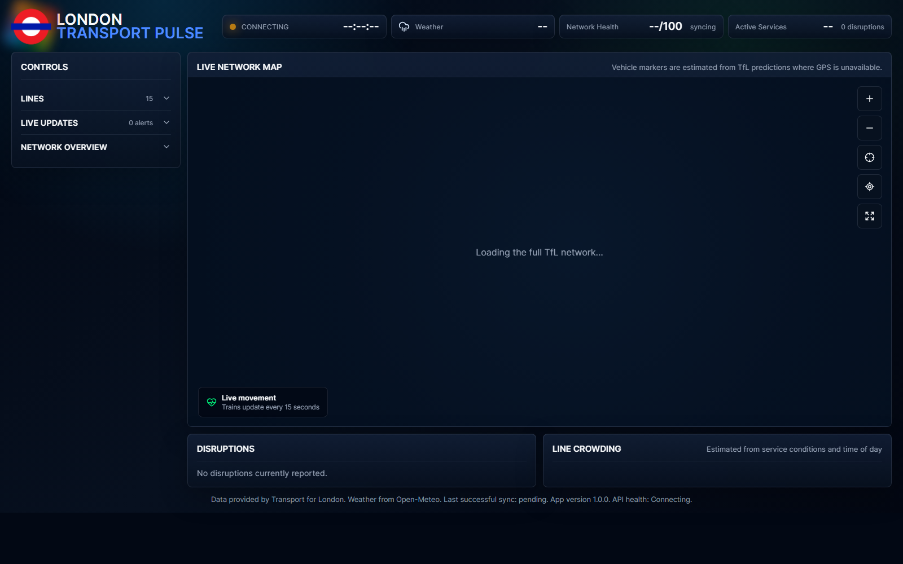

# London Transport Pulse



London Transport Pulse is a real-time London transport dashboard built with Next.js. It combines live TfL service data, route geometry, vehicle predictions, disruption updates, crowding estimates, and weather into a polished operational view.

## Features

- Live network map built from TfL route and station data.
- Draggable and zoomable SVG transport map.
- Train markers positioned on their service lines using TfL arrival predictions.
- Hover-only station names to keep the map clean.
- Line filtering with TfL-style line roundels.
- Collapsible left-side controls for lines, live updates, and network overview.
- Live service status, active disruption count, network health, and weather summary.
- Disruption panel with correct line branding.
- Line crowding estimates based on service conditions and time of day.
- Fallback/mock data mode for development without live API access.
- Responsive dark dashboard layout.

## Tech Stack

- Next.js
- React
- TypeScript
- Framer Motion
- Lucide React
- Transport for London API
- Open-Meteo weather API

## Install

Clone the repository:

```bash
git clone https://github.com/skdsam/London-Transport-Pulse.git
cd London-Transport-Pulse
```

Install dependencies:

```bash
npm install
```

Run the development server:

```bash
npm run dev
```

Open:

```text
http://localhost:3000
```

## Environment Variables

The app can run without TfL credentials, but you can add them for authenticated TfL API requests:

```bash
TFL_APP_ID=your_tfl_app_id
TFL_APP_KEY=your_tfl_app_key
```

Use mock data when live API access is unavailable:

```bash
USE_MOCK_DATA=true
```

## Scripts

```bash
npm run dev
npm run build
npm run start
npm run lint
```

## Data Sources

Transport status, routes, stations, disruptions, departures, and vehicle predictions are provided by Transport for London. Weather data is provided by Open-Meteo.

## Notes

Vehicle positions are estimated from TfL prediction data when direct GPS positions are unavailable, so train markers should be treated as live movement indicators rather than exact physical locations.
